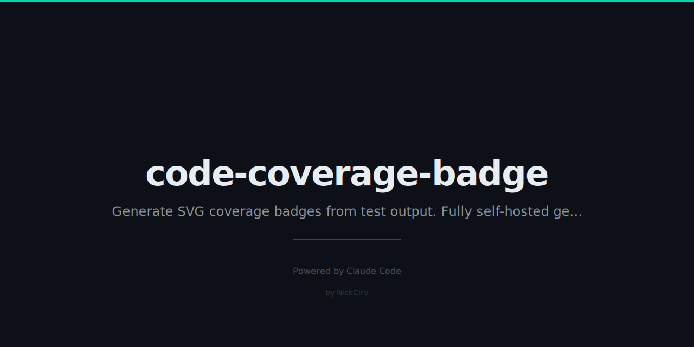

# code-coverage-badge
> Generate SVG coverage badges from test output. No shields.io. No coveralls. Fully self-hosted.

```bash
npx code-coverage-badge
npx code-coverage-badge --readme
```

```
code-coverage-badge
━━━━━━━━━━━━━━━━━━━━━━━━━━━━━━━━━━━
  Detected: coverage/coverage-summary.json (Jest)
  Lines        87.5% ████████████████░░░  ✓ GREEN  ◀
  Branches     72.3% █████████████░░░░░░  △ YELLOW
  Functions    91.0% █████████████████░░  ✓ GREEN

  Badge saved: coverage-badge.svg
  README updated: 
━━━━━━━━━━━━━━━━━━━━━━━━━━━━━━━━━━━
```

## Commands

| Command | Description |
|---------|-------------|
| `ccb` | Auto-detect coverage, generate badge |
| `--coverage 87.5` | Provide coverage directly |
| `--readme` | Update README.md badge |
| `--metric lines\|branches\|functions\|statements` | Which metric to badge |
| `--thresholds 90,75,60` | Green/yellow/red thresholds |
| `--style flat\|flat-square\|for-the-badge` | Badge style |
| `--threshold 80` | Exit 1 if below N% (CI mode) |
| `--commit` | Git commit the badge update |
| `--output <file>` | Custom SVG output path |
| `--label <text>` | Custom badge label text |
| `--format svg\|json\|text` | Output format |

## Supported Coverage Formats

| Format | File | Tools |
|--------|------|-------|
| JSON Summary | `coverage/coverage-summary.json` | Jest, Vitest |
| LCOV | `coverage/lcov.info` | Istanbul, nyc, c8 |
| Clover XML | `coverage/clover.xml` | PHPUnit, Istanbul |
| Raw | `--coverage 87.5` | Any |

## Colors

| Coverage | Color |
|----------|-------|
| ≥ 90% (high threshold) | Green `#4c1` |
| ≥ 75% (medium threshold) | Yellow `#dfb317` |
| ≥ 60% (low threshold) | Orange `#fe7d37` |
| < 60% | Red `#e05d44` |

Thresholds are fully configurable via `--thresholds 90,75,60`.

## CI Usage

```yaml
# GitHub Actions example
- name: Generate coverage badge
  run: |
    npm test -- --coverage
    npx code-coverage-badge --readme --threshold 80 --commit
```

Exit code `1` is returned if coverage is below `--threshold`, making it CI-safe.

## Install

```bash
npx code-coverage-badge
npm install -g code-coverage-badge
```

---

**Zero dependencies** · **Node 18+** · Made by [NickCirv](https://github.com/NickCirv) · MIT
