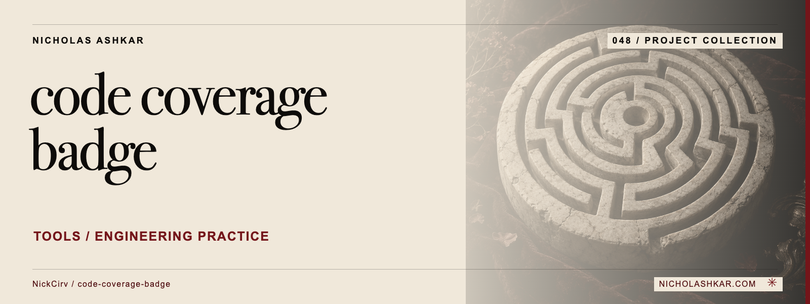

# code-coverage-badge

Generates local coverage badges from reports or an explicitly supplied percentage.


<a id="usage"></a>

<a id="auto-detect-coverage-file-and-generate-badge"></a>

<a id="update-readmemd-badge-inline"></a>

<a id="provide-coverage-directly-skips-file-detection"></a>

<a id="github-actions-example"></a>

## What it does

- Coverage-summary, LCOV and Clover readers.
- SVG styles.
- Metric selection.
- Optional threshold exit status.


<a id="install"></a>

## Quickstart

Prerequisites: Node.js `>=20` and npm; Git is also used by the implementation. The checkout below pins the source used for this documentation.

```sh
git clone https://github.com/NickCirv/code-coverage-badge.git
cd code-coverage-badge
git checkout 66f4a2bdca664e4ad2bf1370f513942fc09dbb67
node index.js --coverage 87.5 --format text
```

**Expected behavior (illustrative, not captured):** Displays a textual representation of the illustrative 87.5% input without claiming measured coverage.

Examples are source-inspected, **not runtime-tested**. See the research record for verification gaps.

## Boundaries and data

A supplied percentage is accepted input, not test evidence. --readme edits documentation and --commit creates a Git commit. Coverage reports must come from a separate test run.


<a id="ci-mode-exit-1-if-coverage-is-below-threshold"></a>

## Development

The manifest defines `npm test` as:

```sh
node --test
```

The captured suite is a smoke check, not end-to-end behavior coverage. Examples include “entry is valid JavaScript”. Tests were not run for this documentation revision.

See [implementation and command reference](docs/REFERENCE.md) for the package scripts and inspected interfaces, and [research record](docs/RESEARCH.md) for the pinned source, document decisions and unresolved checks.

## License and contact

See [LICENSE](LICENSE) for the original terms and attribution. Legal text is unchanged.

[Nicholas Ashkar](https://nicholashkar.com/) · [Discuss a project](https://nicholashkar.com/#oxblood-contact)
